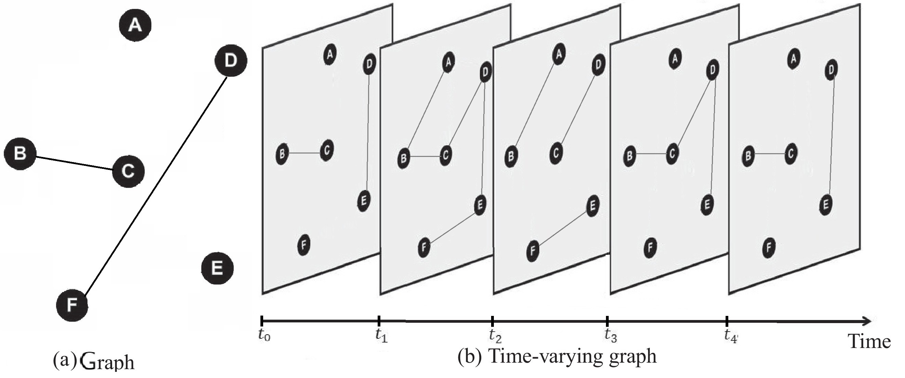
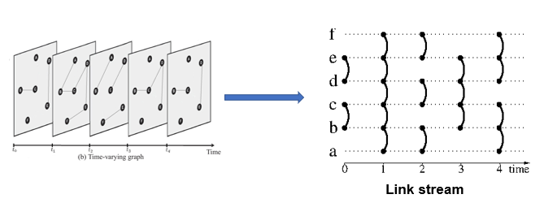

# Temporal-Matching-in-Link-Streams

We present the problem of finding maximum matching edges in temporal graph, for this we use a sequence of pairs of edges of the form (t,{u,v}), that we call a link stream.

We can see an example of temporal graph:

The link stream corresponding:

Given an integer γ and this link-stream L, the γ-edges of L is set of repeated edges between vertices u and v starting at t and ending at t+γ−1:{(t’,{u,v})‖t’∈t,t+γ−1}.

Computing a maximum temporal matching is NP-hard, we introduce a way to compute a 2-approximation with two greedy algorithms Ls and DC:
* Local search heuristic (LS)
With the same example, we have this γ-matching

* Divide and conquer heuristic (DC)
With DC, we have this γ-matching